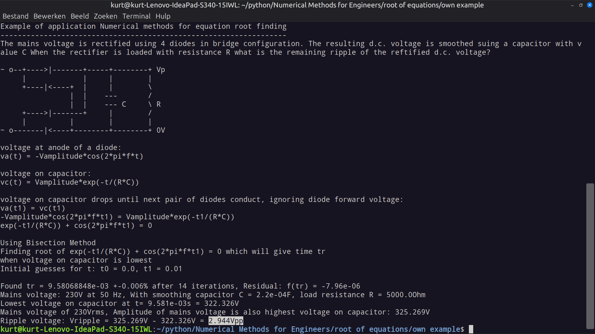
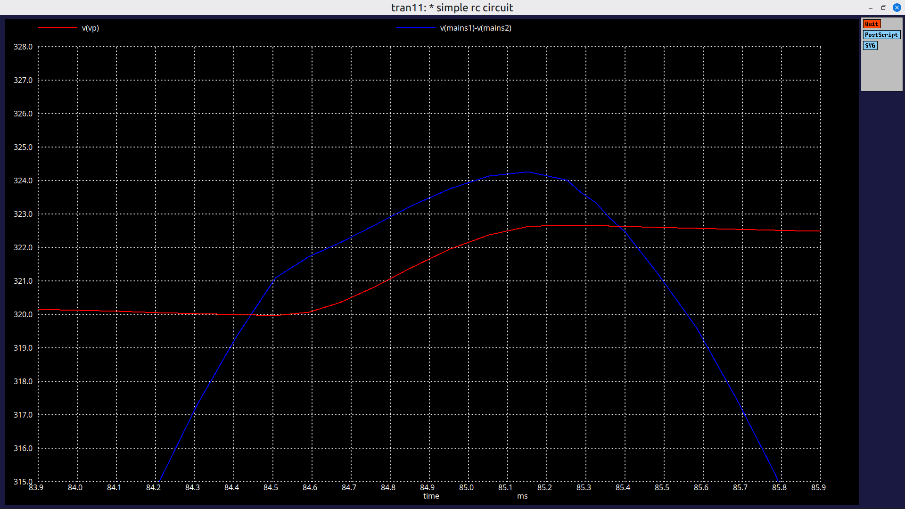
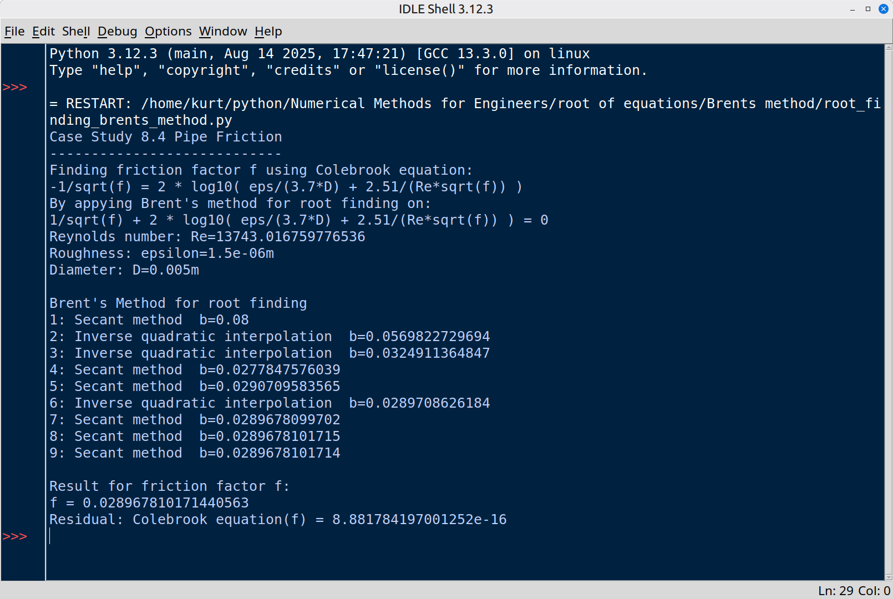

# Numerical Methods For Engineers - Python
Python versions of some of the example pseudocode in the book "Numerical methods for engineers 8th edition". Unless mentioned the code only uses libraries which come with a CPython installation such as math.

## Roots of equations

### Modified False position method
Adapted from pseudocode on page 141

Comparing bisection, false position and modified false position on an given example

[numerical_methods_mod_false_pos.py](numerical_methods_mod_false_pos.py)

### Incremental search for sign changes and modified false position method

As described in NUMERICAL METHODS FOR ENGINEERS  8th Edition

Incremental search for sign changes of function adapted from pseudocode on page 142

Combined with Modified False Position root finding method adapted from pseudocode on page 141

This code allows the user to enter a function of x and a interval on the x-axis.

The interval is searched for sign changes, these points are further refined yielding the roots using modified false position.

code: [numerical_methods_incremental_search_false_pos_3.py](numerical_methods_incremental_search_false_pos_3.py)

A second version also generates a plot using the matplotlib library

code: [numerical_methods_incremental_search_false_pos_plot.py](numerical_methods_incremental_search_false_pos_plot.py)

### Newton-Raphson method

Adapted from NUMERICAL METHODS FOR ENGINEERS 8th Edition from pseudocode on page 153, info on page 157

This method uses both f(x) and the derivative function df(x)/dx to approximate the root

    xn+1 = xn - f(xn) / df(xn)/dt

code: [numerical_methods_newton_raphson.py](numerical_methods_newton_raphson.py)

### Secant method

Using info out of NUMERICAL METHODS FOR ENGINEERS 8th Edition on page 158

The deivative of function f(x) is approximated by

    df(xn)/dt ≈ ( f(xn-1)- f(xn) ) / (xn-1 - xn)

code: [numerical_methods_secant.py](numerical_methods_secant.py)

### Mofidied secant method

Using info out of NUMERICAL METHODS FOR ENGINEERS 8th Edition on page 162

This variant uses a fractional change ε (epsilon) of the independant variable x to prroximate the derivative of f(x)

    df(xn)/dt ≈ ( (f(xn + epsilon*xn) - f(xn) ) / (epsilon*xn)

code: [numerical_methods_modified_secant.py](numerical_methods_modified_secant.py)

### Own example: Ripple voltage of rectified mains voltage

The mains voltage is rectified using 4 diodes in bridge configuration. The resulting d.c. voltage is smoothed using a capacitor with value C When the rectifier is loaded with resistance R what is the remaining ripple of the reftified d.c. voltage?

voltage at anode of a diode:

    va(t) = -Vamplitude*cos(2*pi*f*t)

voltage on capacitor:

    vc(t) = Vamplitude*exp(-t/(R*C))

voltage on capacitor drops until next pair of diodes conduct, ignoring diode forward voltage:

    va(t1) = vc(t1)
    -Vamplitude*cos(2*pi*f*t1) = Vamplitude*exp(-t1/(R*C))
    exp(-t1/(R*C)) + cos(2*pi*f*t1) = 0

This last equation has to be solved fot t1 using numerical methods

This script uses Bisection method to find t1 and the resulting peak to peak ripple voltage.

Code: [rectifier_capacitor_ripple.py](rectifier_capacitor_ripple.py)

The ripple found is 2.9V peak to peak.

A simulation run using NGSPICE finds similar result:

NGSPICE circuit description file: [rectifier_capacitor_ripple.sp](rectifier_capacitor_ripple.sp)

### Brent's Method
The following Python code was adapted from pseudocode demonstrating Brent's method on page 166 of NUMERICAL METHODS FOR ENGINEERS 8th Edition.

Brent's method applies open methods inverse quadratic interpolation, Secant method or closed method Bisection as applicable.

Code: [root_finding_brents_method.py](root_finding_brents_method.py)

The code applies Brent's Method on "Case Study 8.4 Pipe Friction" in the book to find the friction factor using Colebrook equation.

    -1/sqrt(f) = 2 * log10( eps/(3.7*D) + 2.51/(Re*sqrt(f)) )

For a particular set of values for Reynolds number Re, diameter D and roughness eps

