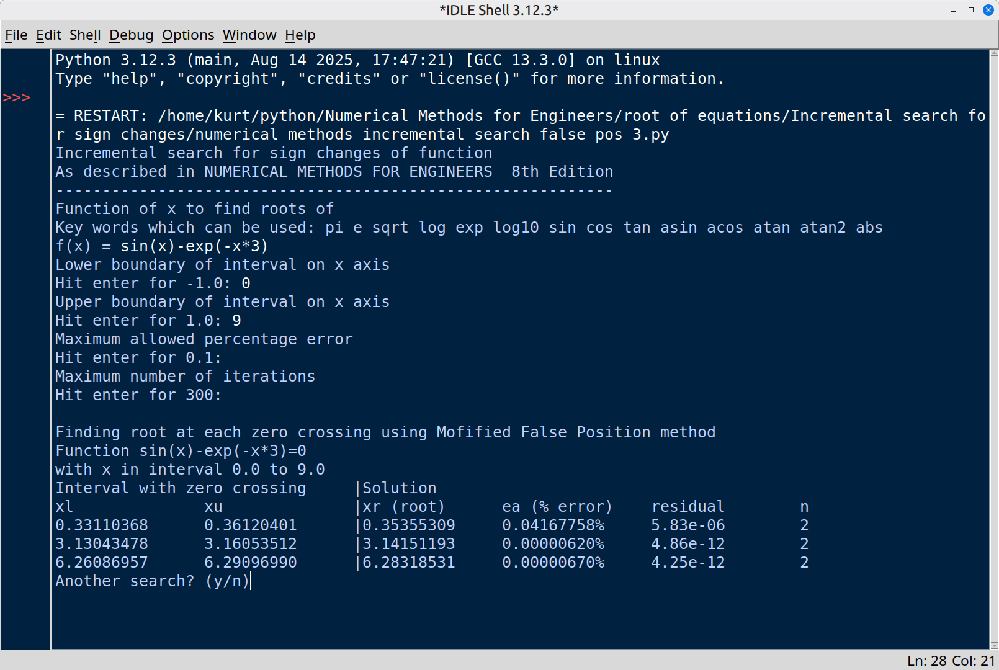
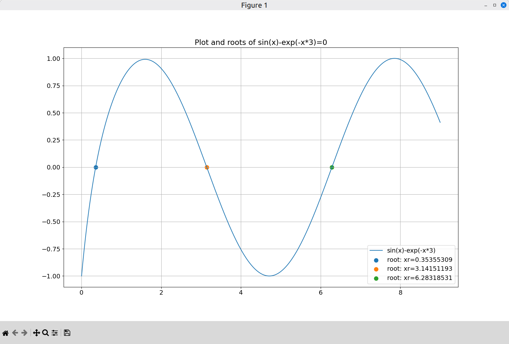

# Numerical-methods-for-engineers-python
Python versions of some of the example pseudocode in the book "Numerical methods for engineers 8th edition""

## Roots of equations

### Modified False position method
Adapted from pseudocode on page 141

Comparing bisection, false position and modified false position on an given example

[numerical_methods_mod_false_pos.py](numerical_methods_mod_false_pos.py)

### Incremental search for sign changes and modified false position method

As described in NUMERICAL METHODS FOR ENGINEERS  8th Edition

Incremental search for sign changes of function adapted from pseudocode on page 142

combined with modified false position root finding method adapted from pseudocode on page 141

This code allows the user to enter a function of x and a interval on the x-axis.

The interval is searched for sign changes, these points are furhter refined yielding the roots using modfified false position.

code: [numerical_methods_incremental_search_false_pos_3.py](numerical_methods_incremental_search_false_pos_3.py)

A second version also generates a plot using the matplotlib library

code: [numerical_methods_incremental_search_false_pos_plot.py](numerical_methods_incremental_search_false_pos_plot.py)

